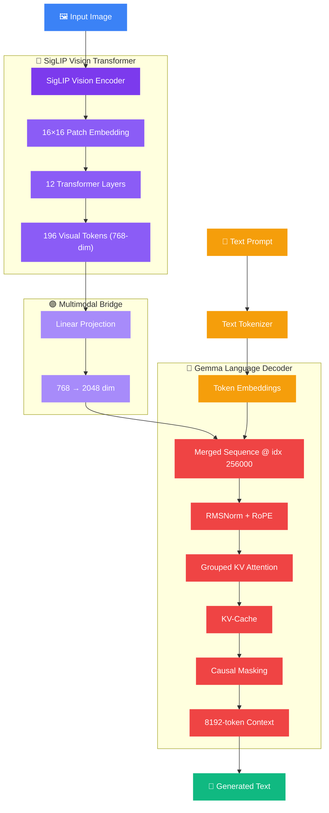

<div align="center">

<!-- Animated Header -->


<!-- Typing SVG -->
<a href="https://git.io/typing-svg"></a>

<br/>

<!-- Tech Badges -->


<br/><br/>

<!-- Stats -->


</div>

---

<div align="center">
<h2>🎯 What This Is</h2>
<p><i>A complete from-scratch PyTorch implementation of Google's PaliGemma Vision-Language Model.</i></p>
</div>

> **Why from scratch?** Because calling `model = AutoModel.from_pretrained()` teaches you nothing about *how* the model actually processes images and generates text. Building every component by hand — from patch embeddings to KV-cache — is the only way to truly understand modern VLMs.

---

<div align="center">
<h2>🏗️ Architecture</h2>
</div>



---

<div align="center">
<h2>🧩 Components Built from Scratch</h2>
</div>

<table>
<tr>
<td align="center" width="33%">
<br/><br/>
<b>12-Layer Vision Transformer</b><br/>
16×16 patch embeddings<br/>
196 visual tokens<br/>
768-dim output space
</td>
<td align="center" width="33%">
<br/><br/>
<b>Linear Projection Layer</b><br/>
768 → 2048 dimensions<br/>
Bridges vision & language<br/>
Merges at index 256000
</td>
<td align="center" width="33%">
<br/><br/>
<b>Full Language Decoder</b><br/>
RMSNorm + RoPE<br/>
Grouped KV Attention<br/>
8192-token context
</td>
</tr>
</table>

<br/>

<details>
<summary><b>📋 Full Component Checklist (click to expand)</b></summary>
<br/>

| Component | Status | Details |
|:----------|:------:|:--------|
| SigLIP Vision Encoder | ✅ | 12 transformer layers, 768-dim embeddings |
| 16×16 Patch Embeddings | ✅ | Image → 196 visual tokens |
| Multimodal Projector | ✅ | Linear 768→2048 bridge layer |
| Image-Token Merging | ✅ | Visual tokens inserted at index 256000 |
| RMSNorm | ✅ | Root Mean Square pre-normalization |
| Rotary Position Embeddings (RoPE) | ✅ | Relative position encoding in attention |
| Grouped Query Attention | ✅ | Efficient KV head grouping |
| KV-Cache | ✅ | Cached key-value for fast generation |
| Causal Masking | ✅ | Proper multimodal causal masks |
| 8192-Token Context | ✅ | Full context window support |

</details>

---

<div align="center">
<h2>📁 Project Structure</h2>
</div>

```
Pytorch_PaliGemma/
├── 🔵 modeling_siglip.py         # SigLIP Vision Transformer (encoder)
├── 🔴 modelling_gemma.py         # Gemma Language Model (decoder)
├── 🟣 processing_paligemma.py    # Image & text preprocessing
└── 📄 README.md
```

---

<div align="center">
<h2>🚀 Quick Start</h2>
</div>

```bash
git clone https://github.com/udayraj1238/Pytorch_PaliGemma.git
cd Pytorch_PaliGemma
pip install torch torchvision pillow
```

```python
from modeling_siglip import SigLIPVisionModel
from modelling_gemma import GemmaForCausalLM

# Vision encoder
vision_model = SigLIPVisionModel(config)
visual_tokens = vision_model(pixel_values)  # [B, 196, 768]

# Project to language space
projected = projector(visual_tokens)  # [B, 196, 2048]

# Merge with text tokens and generate
output = gemma_model.generate(merged_input)
```

---

<div align="center">
<h2>💡 What I Learned</h2>
</div>

<table>
<tr>
<td>🔗</td>
<td><b>Image-token merging</b> is not concatenation — the projector learns a mapping between fundamentally different representation spaces</td>
</tr>
<tr>
<td>🔄</td>
<td><b>RoPE</b> makes position information part of the attention computation itself, not just the input</td>
</tr>
<tr>
<td>⚡</td>
<td><b>KV-Cache</b> is where inference bottlenecks live — building it by hand reveals exactly why</td>
</tr>
<tr>
<td>🧮</td>
<td><b>Grouped KV attention</b> reduces memory proportional to the group ratio while preserving representational capacity</td>
</tr>
</table>

---

<div align="center">
<h2>📚 References</h2>

[PaliGemma Paper](https://arxiv.org/abs/2407.07726) • [SigLIP Paper](https://arxiv.org/abs/2303.15343) • [Gemma Paper](https://arxiv.org/abs/2403.08295)

<br/>

<h2>🤝 Contact</h2>
<a href="https://www.linkedin.com/in/uday6002/"></a>
<a href="https://udayraj1238.vercel.app"></a>
<a href="mailto:rajuday6002@gmail.com"></a>

</div>


